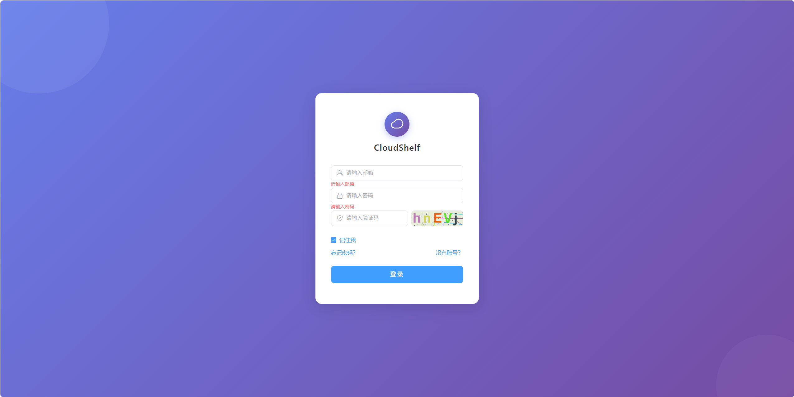
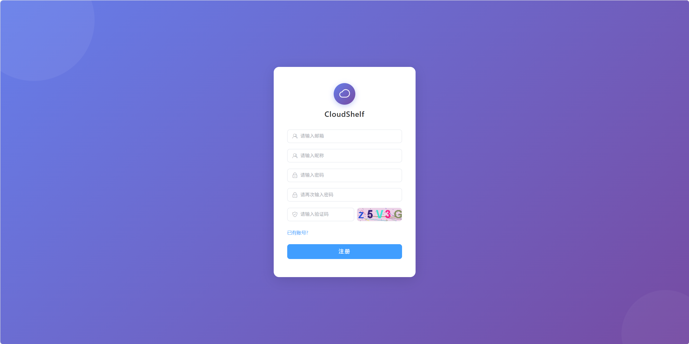
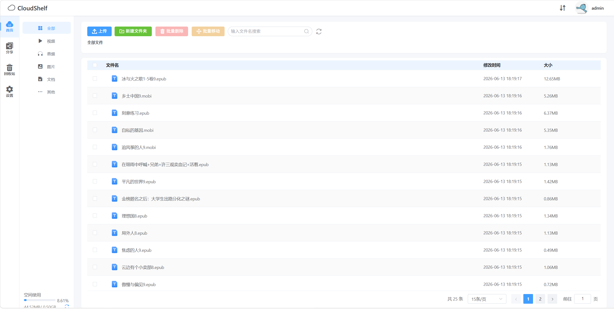
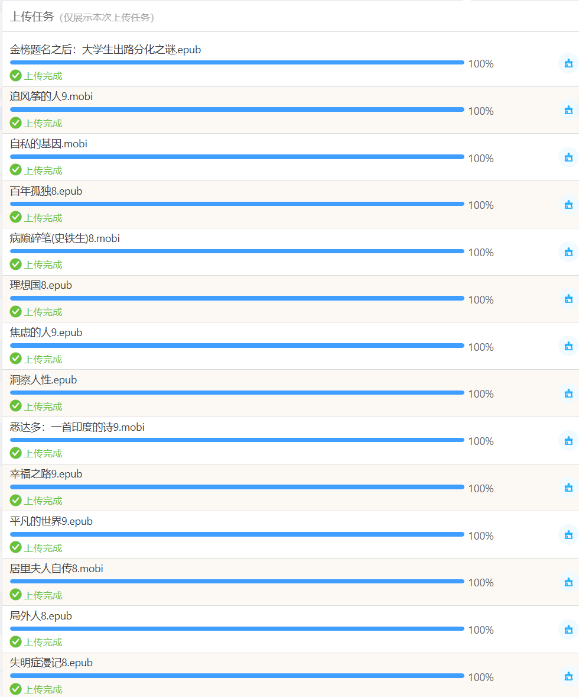
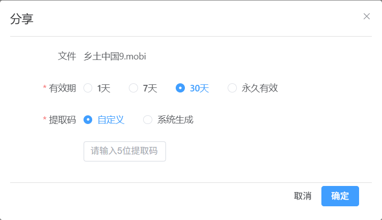
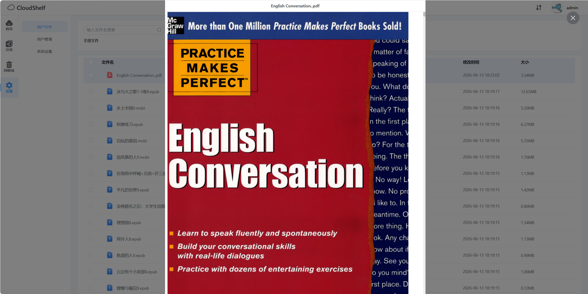
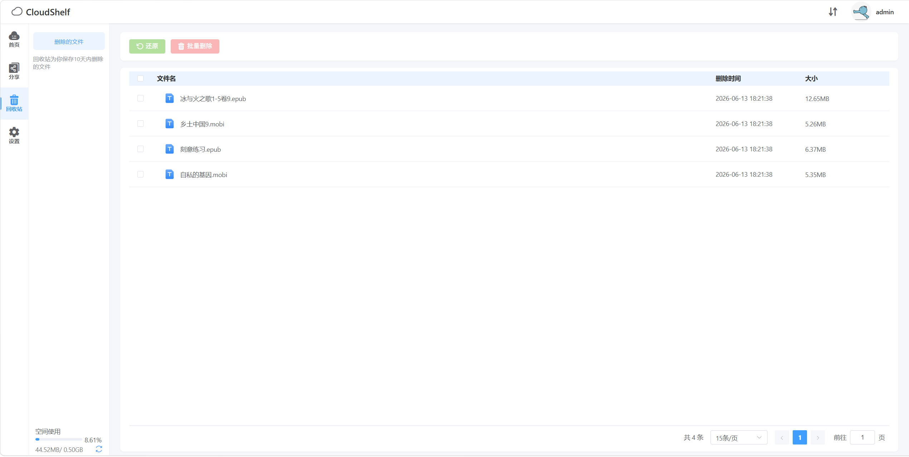
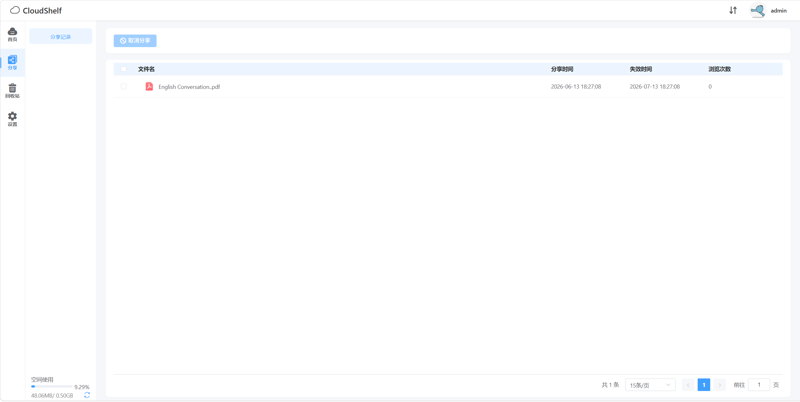
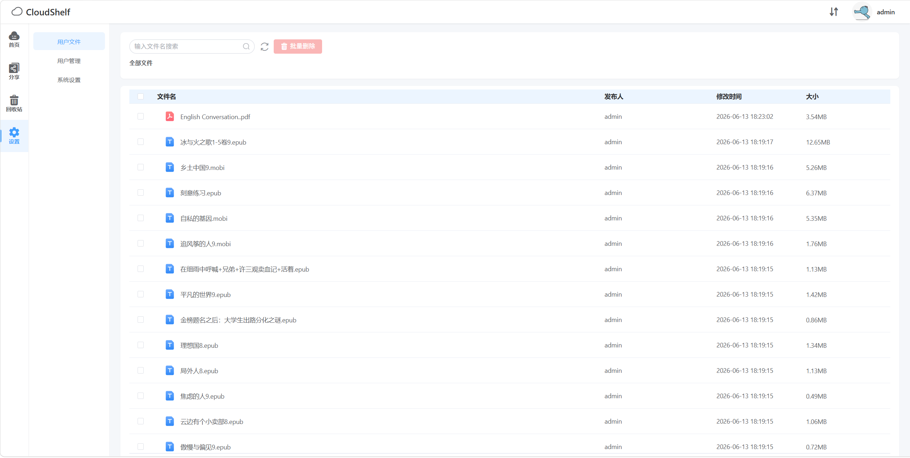
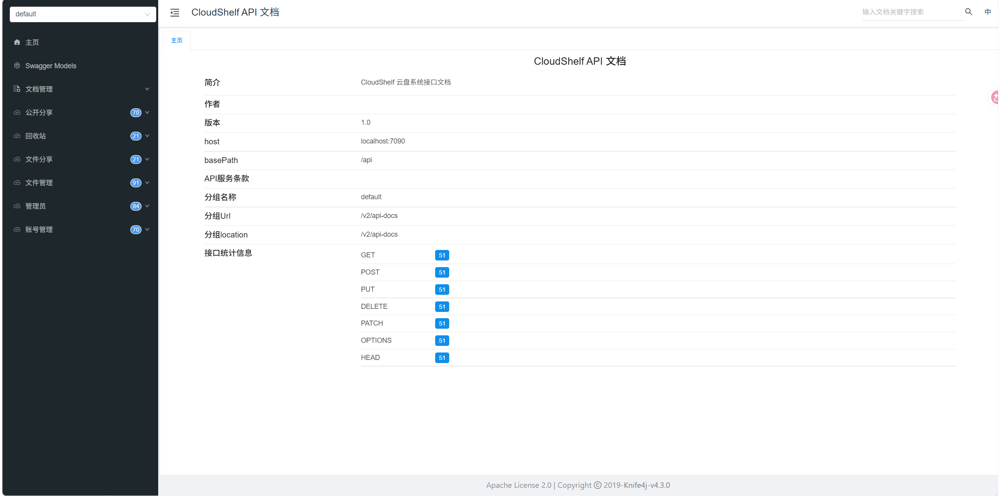

<p align="center">
  
</p>

<h1 align="center">CloudShelf</h1>

<p align="center">
  <strong>CloudShelf —— 轻量级个人云盘系统</strong>
</p>

<p align="center">
  
  
  
  
  
  
</p>

---

## 📖 目录

- [项目简介](#-项目简介)
- [功能特性](#-功能特性)
- [技术栈](#-技术栈)
- [项目结构](#-项目结构)
- [环境要求](#-环境要求)
- [快速开始](#-快速开始)
- [系统截图](#-系统截图)
- [API 文档](#-api-文档)
- [配置说明](#-配置说明)

---

## 📌 项目简介

CloudShelf 是一款基于 **Vue 3 + Spring Boot** 的个人云盘系统，提供文件上传、在线预览、多格式支持、分享下载、回收站、管理员后台等完整的网盘功能，适用于个人/小团队的文件存储与管理场景。

---

## ✨ 功能特性

### 文件管理

| 功能 | 说明 |
|------|------|
| 📁 文件夹管理 | 新建、重命名、移动、层级导航 |
| 📤 文件上传 | 支持大文件分片上传、断点续传、秒传（MD5 校验） |
| 📥 文件下载 | 支持生成下载链接、提取码下载 |
| 🔍 分类浏览 | 按视频/音频/图片/文档/其他分类筛选 |
| 🗑️ 回收站 | 软删除 → 回收站 → 定时清理（3 分钟轮询） |
| 📋 批量操作 | 批量移动、批量删除、批量恢复 |

### 在线预览

| 类型 | 支持格式 | 技术方案 |
|------|----------|----------|
| 🎬 视频 | mp4, mkv 等 | HLS 转码 + DPlayer 播放器 |
| 🎵 音频 | mp3 等 | APlayer 播放器 |
| 🖼️ 图片 | jpg, png, gif 等 | 原生图片预览 + 缩放 |
| 📄 文档 | pdf, docx, xlsx, txt, 代码文件 | PDF.js / docx-preview / highlight.js |

### 用户体系

| 功能 | 说明 |
|------|------|
| 👤 注册登录 | 邮箱注册 + 图片验证码 |
| 🔐 密码管理 | MD5 加密存储、在线修改密码 |
| 🖼️ 头像管理 | 支持上传自定义头像 |
| 🛡️ 权限控制 | AOP 拦截器实现登录校验、参数校验、管理员校验 |

### 文件分享

| 功能 | 说明 |
|------|------|
| 🔗 创建分享 | 支持设置有效期（1天/7天/30天/永久）和提取码 |
| 👁️ 分享浏览 | 匿名用户可通过分享链接 + 提取码访问文件 |
| 📊 浏览次数 | 记录分享链接浏览次数 |

### 管理员后台

| 功能 | 说明 |
|------|------|
| ⚙️ 系统设置 | 注册邮件模板、新用户初始空间配置 |
| 👥 用户管理 | 用户列表、状态启用/禁用、空间配额调整 |
| 📂 文件管理 | 查看所有用户文件、管理员删除 |

---

## 🛠 技术栈

### 后端

| 技术 | 版本 | 用途 |
|------|------|------|
| Java | 1.8 | 运行环境 |
| Spring Boot | 2.6.1 | 核心框架 |
| MyBatis | 1.3.2 | ORM 框架 |
| MySQL | 8.0 | 关系型数据库 |
| Redis | — | 缓存 / 分布式锁 |
| Knife4j | 4.3.0 | API 文档（Swagger 增强） |
| Fastjson | 1.2.66 | JSON 序列化 |
| Logback | 1.2.10 | 日志框架 |

### 前端

| 技术 | 版本 | 用途 |
|------|------|------|
| Vue | 3.2 | 前端框架 |
| Vite | 4.1 | 构建工具 |
| Vue Router | 4.1 | 路由管理 |
| Pinia | 2.0 | 状态管理 |
| Element Plus | 2.2 | UI 组件库 |
| Axios | 1.3 | HTTP 请求 |
| DPlayer | 1.27 | 视频播放器 |
| APlayer | 1.10 | 音频播放器 |
| Highlight.js | 11.7 | 代码高亮 |
| Spark-MD5 | 3.0 | 文件 MD5 计算 |
| HLS.js | 1.1 | HLS 流播放 |
| Sass | 1.59 | CSS 预处理 |

---

## 🔧 环境要求

| 组件 | 最低版本 | 说明 |
|------|----------|------|
| JDK | 1.8+ | Java 运行环境 |
| Maven | 3.6+ | 后端构建 |
| Node.js | 16+ | 前端构建 |
| MySQL | 5.7+ | 数据库 |
| Redis | 6.0+ | 缓存服务 |
| FFmpeg | 4.0+ | 视频转码 |

---

## 🚀 快速开始

### 1. 克隆项目

```bash
git clone https://github.com/xie-hz/CloudShelf.git
cd CloudShelf
```

### 2. 初始化数据库

```sql
-- 创建数据库
CREATE DATABASE IF NOT EXISTS cloudshelf DEFAULT CHARSET utf8mb4 COLLATE utf8mb4_general_ci;

-- 导入表结构
USE cloudshelf;
SOURCE cloudshelf.sql;
```

### 3. 配置后端

编辑 `CloudShelf/src/main/resources/application.properties`：

```properties
# 数据库配置
spring.datasource.url=jdbc:mysql://127.0.0.1:3306/cloudshelf?serverTimezone=GMT%2B8&useUnicode=true&characterEncoding=utf8&useSSL=false
spring.datasource.username=username
spring.datasource.password=password

# Redis 配置
spring.redis.host=127.0.0.1
spring.redis.port=6379

# 文件存储根目录（绝对路径，以 / 结尾）
project.folder=D:/CloudShelf/

# 管理员邮箱（多个用逗号分隔）
admin.emails=admin@qq.com
```

### 4. 启动后端

```bash
cd CloudShelf
mvn clean package -DskipTests
mvn spring-boot:run
# 或: java -jar target/cloudshelf-1.0.jar
```

后端启动后访问：
- API 地址：`http://localhost:7090/api`
- API 文档：`http://localhost:7090/api/doc.html`

### 5. 启动前端

```bash
cd CloudShelf-front
npm install
npm run dev
```

前端启动后访问：`http://localhost:1024`


---

## 📸 系统截图

### 登录注册

登录页



注册页



### 文件管理

主页



上传文件



分享文件



### 在线预览

文件预览



### 其他功能

回收站



我的分享



### 管理员后台

文件管理、用户管理、系统设置



---

## 📚 API 文档

项目集成 **Knife4j**（Swagger 增强），启动后端后访问：

```
http://localhost:7090/api/doc.html
```

### 主要接口模块

| 模块 | 路径前缀 | 说明 |
|------|----------|------|
| 账号管理 | `/api/` | 注册、登录、退出、验证码、头像、密码 |
| 文件管理 | `/api/file/` | 文件 CRUD、上传、下载、预览 |
| 回收站 | `/api/recycle/` | 回收站列表、恢复、彻底删除 |
| 分享管理 | `/api/share/` | 创建分享、取消分享、分享列表 |
| 公开分享 | `/api/showShare/` | 匿名访问分享内容 |
| 管理员 | `/api/admin/` | 系统设置、用户管理、全局文件管理 |



---

## ⚙️ 配置说明

### 核心配置项

| 配置项 | 说明 | 示例值 |
|--------|------|--------|
| `server.port` | 后端端口 | `7090` |
| `server.servlet.context-path` | 接口前缀 | `/api` |
| `spring.datasource.*` | 数据库连接 | — |
| `spring.redis.*` | Redis 连接 | — |
| `project.folder` | 文件存储根目录（绝对路径） | `D:/CloudShelf/file/` |
| `admin.emails` | 管理员邮箱（逗号分隔） | `admin@qq.com` |
| `dev` | 开发模式（`true` 关闭部分校验） | `false` |

### 定时任务

| 任务 | 频率 | 说明 |
|------|------|------|
| `FileCleanTask` | 每 3 分钟 | 扫描回收站中过期的文件并彻底删除 |

